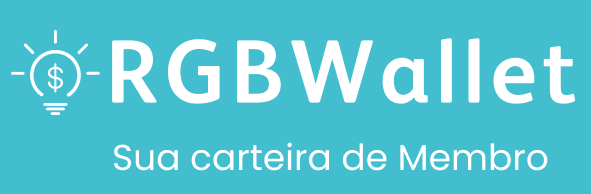

# 💰RGBWallet💡
Trainee admission project for ICMC Jr Junior Enterprise @USP.  It's a web-based project consisting of a simple CRUD for a digital wallet, with ADMIN and USER funcions.

## 🛠️ Tools
What we used to make this project possible

### Design
* Figma
* Awesome Icons

### Front-end
* Bootstrap (CDN Version)
* CSS

### Back-end
* JS
* React
* MongoDB
* Node.js

## ✨ Features 
The document containing the client's description for this project's features can be found [here](https://drive.google.com/file/d/1W3Xj5Vy73h6mo37CGoguPnMa-BOt-mNl/view?usp=sharing)

## 👥 The Team
The project was assembled by 2 trainee developers and a senior ICMC Jr member, who will act as the SCRUM Master:

* **Kibe**
* Beneti
* Kenzo
