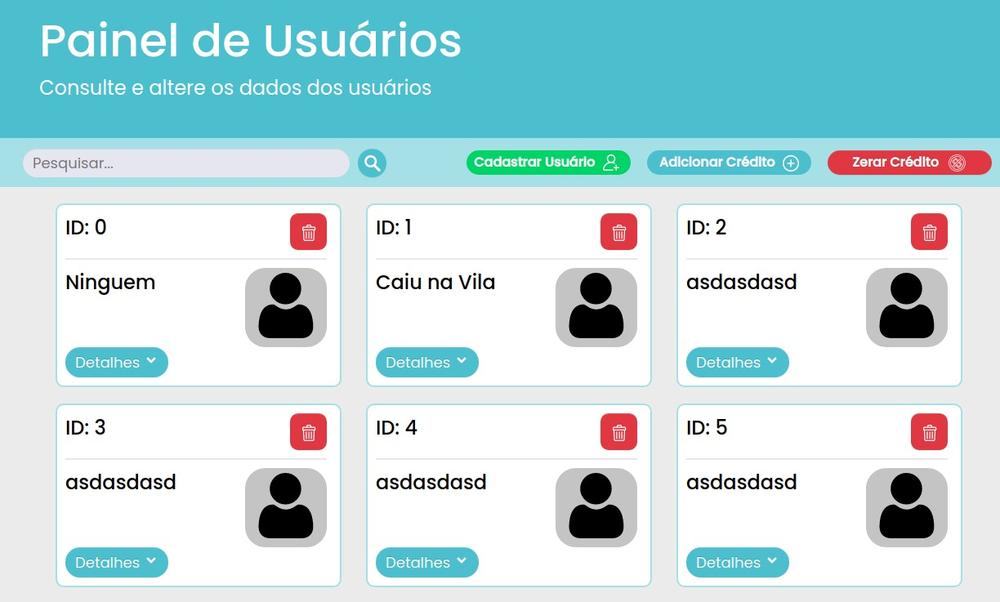

# 💰RGBWallet💡
Trainee admission project for "ICMC Jr" Junior Enterprise @USP.  It's a web-based project consisting of a simple CRUD for a digital wallet, with ADMIN and USER funcions.

<p align="center">
      
</p>

## Pictures

### Admin Dashboard

<p align="center">
      
</p>

## 🛠️ Tools
What we used to make this project possible

### Prototyping
* Figma

### Front-end
* Bootstrap (CDN Version)
* React
* HTML
* CSS

### Back-end
* JS
* Node.js

### DB and Server
* MongoDB
* Express
* Insomnia

## Usage
As of now, you can test this project by typing
```
npm start
```
in both web/ and backend/ folders

## ✨ Features 
The document containing the client's description for this project's features can be found [here](https://drive.google.com/file/d/1W3Xj5Vy73h6mo37CGoguPnMa-BOt-mNl/view?usp=sharing)

## 👥 The Team
The project was assembled by 2 trainee developers and a senior ICMC Jr member, who will act as the SCRUM Master:

* **Kibe**
* Beneti
* Kenzo
